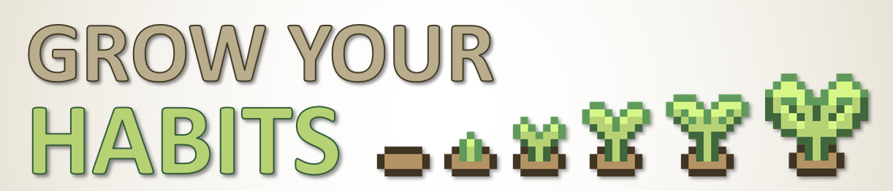
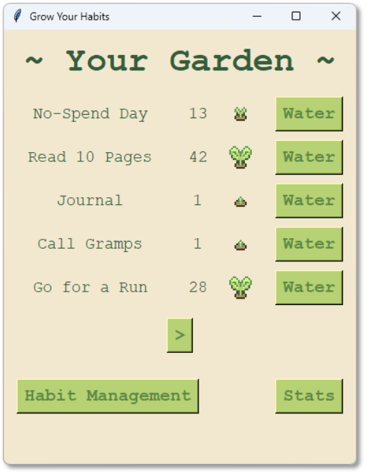
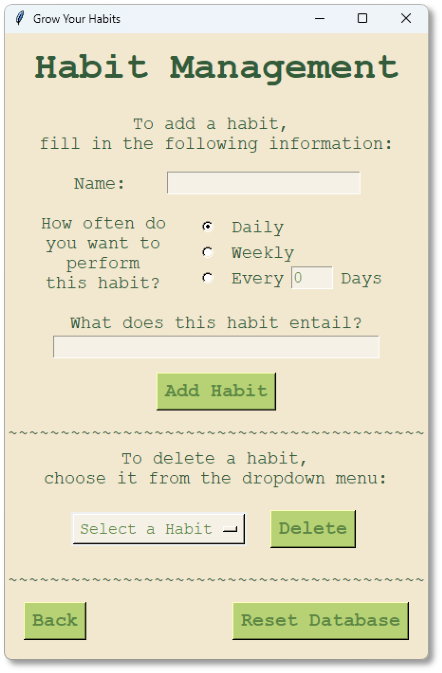
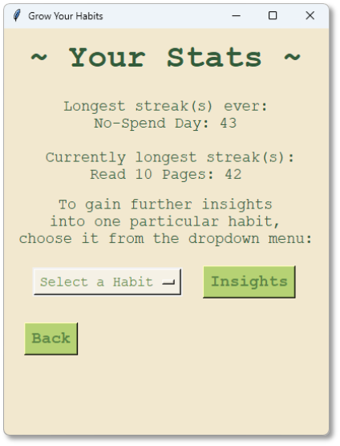

<div align="center">

</div>

# Grow Your Habits - A Habit Tracking project for IU
Most people looking into productivity tools have at this point most likely heard of a habit tracker.
It's a tool to track regular habits like exercising or watering one's plants
to give you an easy to-do-list for your day of the things that actually matter to you.
I created this particular version of a habit tracker as my assignment for the course
Object Oriented and Functional Programming with Python at IU and learned a lot during development
(as can be plainly seen when looking back on the early versions of the tracker).

To add a bit of flavor to the project, I chose to give the entire application a bit of a gardening theme, letting you
plant and grow your habits as one would add to and nurture in a garden.
<hr style="clear:both;">

## Functionality
The habit tracker in its base form allows you to create habits, check them off as finished, or delete them.
Additionally, you can check various statistics regarding your habits.

### First Start
When booting the application for the first time, you are prompted to choose whether you want to start with a "pre-grown"
garden or with your own already. The "pre-grown" version contains a number of habits as if you'd set up your own a few
weeks ago and been using it ever since. Feel free to get to know the application there first before diving in.
You can find your way back here from the Habit Management menu later on to start your own garden.

<div>

### "Checking off" a Habit or *Watering your plants*

The Garden menu shows you all your habits as well as their currently ongoing streak. Use the watering button to confirm
you've performed the habit today and watch your little plant grow over time. This plant has different stages it goes
through over time.<br>When you first plant the seed, or if your plant has withered away due to breaking your streak, the
patch is empty, but even watering for one day lets the sprout break through the ground. Each consecutive
week of watering will then let the plant grow even further until it's reached its final stage at 4 weeks.

If you feel like there are habits missing from your garden, use the arrow buttons (if there are any) to flip between the pages and see
the rest of your habits to check and water them as well.

Since plants, especially digital ones, don't really care too much about when in the day they are watered, the day in
the application resets itself at 2 AM instead of midnight. So nightowls don't need to worry too much about hitting their
deadline exactly.
</div><hr style="clear:both;">

<div>

### Adding, Removing or *Planting* your habits

If you're setting up the garden for the first time, or you press the "Habit Management" button in the Garden menu,
you'll be given the option to add new habits or (if there are any) remove existing habits from the database.

To add a new habit, simply enter
* Its name
* How often you want to perform it and
* A brief description of what your habit entails

After confirming your choices, a new plant is planted into the soil, and you can start watering it immediately!

To remove an existing habit, simply choose it from the dropdown menu and confirm your choice. It and all its watering
checks are then removed from the database.

If you want a fresh start, or are done checking out the demo version of the pre-grown garden, you can also choose to
reset the database entirely with the "Reset Database" button. This will take you back to the original welcome screen.
</div><hr style="clear:both;">

<div>

### Statistics

From the garden menu, you also have the option to gain further insights into your patch of habits. Using the "Stats"
button takes you to the general analytics overview.

#### General Statistics

These include your longest currently ongoing streak, or streaks if there is a tie, and your formerly longest streak.
If you want to learn more about a specific habit, you can choose it from the dropdown menu and gain further insights!

#### Individual Statistics

The individual habit statistics go into more detail about your chosen habit. Firstly, it includes an overview of
its general settings (periodicity, description and date created). These are then followed by information on your currently ongoing
streak, your best former streak and your consistency in the past four weeks, meaning how often you marked your habit
completed within that timeframe out of how often you should have (e.g. watering a weekly habit during 3 out of 4 times)
</div><hr style="clear:both;">

## Installation
The application was developed in Python 3.11,
so older versions might not support all functionalities used in the application.
Additionally, in order to run the application,
you will first need to ensure all required packages and modules are installed.
For this you can run the following command in your python terminal.
```shell
pip install -r requirements.txt
```

## Running the Test Suite
For testing all functionalities of the application as test suite has been provided,
which you can call in the python terminal with the following command.
```shell
python -m pytest
```

## Running the Application
For running the actual application, call the following command on your python terminal.
```shell
python main.py
```